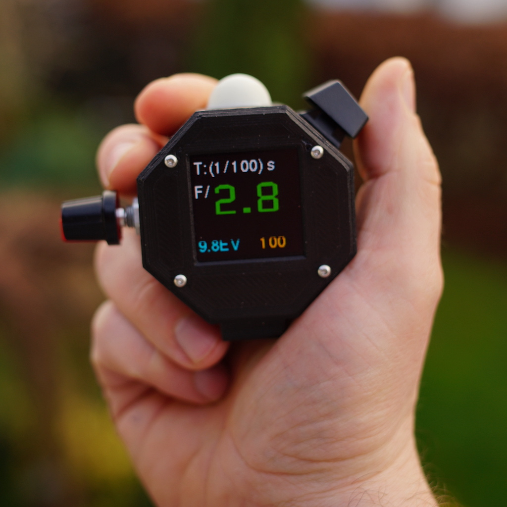

# Pimoroni Pico LiPo case with Lumisphere

This case is completely redesigned, but very similar to the original firstframe.stl design and only slightly larger.

### Author
- [Frederik Kemner](https://github.com/040medien)

### These were my requirements:
- Add a dedicated lumisphere dome and move the [Pimoroni BH1745](https://shop.pimoroni.com/products/bh1745-luminance-and-colour-sensor-breakout?variant=12767599755347) light sensor board inside the case for protection.
- Make the [Waveshare 128x128 full color](https://www.amazon.de/-/en/gp/product/B07DB5YFGW/ref=ppx_yo_dt_b_asin_title_o08_s00?ie=UTF8&psc=1) display fit without needing to sand off the corners.
- Use the [Pimoroni Pico LiPo](https://shop.pimoroni.com/products/pimoroni-pico-lipo?variant=39386149093459) board, since you don't have to use a separate LiPo Shim, it supports USB-C and has its own power button.
- Keep the case small. This required using a smaller [820mAh lipo battery](https://www.amazon.de/gp/product/B082152887).
- Make all parts printable without supports.

### Notes:
- The lumishpere and the power button were printed with a resin SLA printer. It might work with FDM, but I haven't tried.
- The lumisphere will make sure that you measure the ambient light instead of the reflected light.
- In my case I had to add a 1.5 stop correction to the measurement since there is some light loss due to the lumisphere. This is done by changing `evcorrection` to `1.5` in `main.py`.

### Assembly instructions:
- You need 4 M2 screws for the top, 4 M2.5 screws for the bottom, 2 M2.5 screws for the microswitch bracket and 2 M2 screws for the lumishpere.
- First solder on the wires to the components and then install the microswitch and the lumishpere before everything else. These are tricky. Next the [rotary encoder](https://www.berrybase.de/drehregler/rotary-encoder-mit-breakoutboard) with the connectors facing towards the Pico. I heated the little prong to seat it into the case. I had to bend the connectors and solder on the wires since dupont connectors didn't fit into the case anymore. I used some double sided tape to stick on the battery. The Pico LiPo just slots in and gets held in by the back part.
- The power button is a bit fiddly. I used a tiny ring of soft insulation foam between it and the case so it doesn't drop down and get jammed.
- The power button guard has to be glued on. It prevents the meter from accidentally coming on when bumped in your camera bag.
- I soldered on the connections to the top side of the Pico since I didn't want any pointy solder blobs pierce the lipo below.
